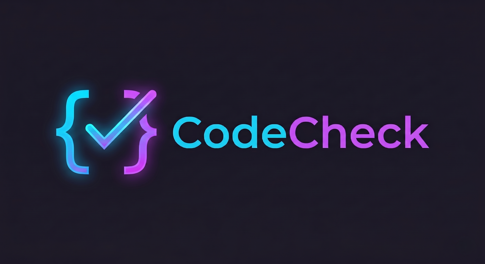

<div align="center">



### Plataforma de avaliação automática de código para exames de programação

<p>
  <a href="https://github.com/mneto19/codecheck/actions/workflows/ci.yml">
    
  </a>
  
  
  
  
  
</p>

</div>

---

## Sobre o Projeto

**CodeCheck** é uma plataforma web para a realização e avaliação automática de exames de programação. Os professores criam salas de exame com questões de código, e os alunos entram apenas com um código de 6 letras — sem necessidade de conta.

Cada submissão é executada em ambiente isolado via **JDoodle** e avaliada automaticamente pela IA da **Groq**, que compara semanticamente o código do aluno com a solução de referência, gera feedback detalhado e deteta possíveis utilizações de IA generativa.

| Papel | Fluxo |
|---|---|
| 👨‍🏫 **Professor** | Cria sala → adiciona questões com código de referência → inicia exame → monitoriza submissões em tempo real |
| 👨‍💻 **Aluno** | Entra com código de 6 letras → escreve solução no editor Monaco → submete → recebe score e feedback |

---

## Funcionalidades

- **Editor Monaco integrado** — o mesmo motor do VS Code, com syntax highlighting e autocompleção
- **Execução em tempo real** — código compilado e executado via JDoodle (Python, Java, C, C++, JavaScript, C#)
- **Avaliação por IA** — Groq analisa semanticamente o código, atribui pontuação (0–100) e gera feedback
- **Deteção de código gerado por IA** — classificação automática com grau de certeza
- **Salas em tempo real** — Socket.io sincroniza timer, submissões e estado entre professor e alunos
- **Timer sincronizado** — conta regressiva partilhada, com alertas nos últimos 5 minutos
- **Dashboard de resultados** — ScoreRing visual, comparação lado a lado do código do aluno vs referência
- **Exportação CSV** — notas prontas a importar no Excel
- **Sem conta para alunos** — entrada apenas com código de sala + nickname

---

## Stack Tecnológico

### Backend


### Frontend


### Infraestrutura


---

## Arquitetura

```
┌──────────────────────────────────────┐
│       Browser  (Aluno / Professor)   │
│       React 18 · Monaco Editor       │
└───────────────┬──────────────────────┘
                │  HTTP REST + WebSocket
                ▼
┌──────────────────────────────────────┐
│       Railway — Express API          │
│  Auth JWT · Zod · Helmet · Rate Limit│
│  Worker Queue  (máx. 3 concorrentes) │
└──────┬───────────────┬───────────────┘
       │  Prisma ORM   │  HTTP
       ▼               ▼
┌─────────────┐  ┌─────────────────────┐
│  Supabase   │  │  JDoodle  │  Groq   │
│ PostgreSQL  │  │ (execução)│  (IA)   │
└─────────────┘  └─────────────────────┘
```

---

## Primeiros Passos

### Pré-requisitos

- [Node.js](https://nodejs.org/) ≥ 20
- Conta [Supabase](https://supabase.com) (base de dados PostgreSQL)
- API key [Groq](https://console.groq.com) (avaliação por IA)
- Conta [JDoodle](https://www.jdoodle.com/compiler-api) (execução de código)

### Instalação

```bash
git clone https://github.com/mneto19/codecheck.git
cd codecheck
```

**Backend:**

```bash
cd backend
npm install
# Cria o ficheiro .env e preenche as variáveis (ver secção abaixo)
npx prisma generate
npx prisma migrate dev
npm run dev        # http://localhost:3000
```

**Frontend** (novo terminal):

```bash
cd frontend
npm install
npm run dev        # http://localhost:5173
```

---

## Variáveis de Ambiente

Cria o ficheiro `backend/.env` com as seguintes variáveis:

| Variável | Descrição |
|---|---|
| `DATABASE_URL` | Connection string Supabase via pgBouncer |
| `DIRECT_URL` | Connection string direta Supabase (para migrações) |
| `JWT_SECRET` | Segredo JWT — mínimo 64 caracteres aleatórios |
| `GROQ_API_KEY` | API key da [Groq](https://console.groq.com) |
| `JDOODLE_CLIENT_ID` | Client ID da [JDoodle API](https://www.jdoodle.com/compiler-api) |
| `JDOODLE_CLIENT_SECRET` | Client Secret da JDoodle API |
| `CORS_ORIGINS` | URL do frontend (ex: `https://codecheck.vercel.app`) |
| `PORT` | Porta do servidor (default: `3000`) |

---

## Deployment

### Backend → Railway

Configurado em [`backend/railway.toml`](./backend/railway.toml):

- **Root Directory:** `backend/`
- **Build:** `npm install && npx prisma generate`
- **Start:** `npm start`
- **Health check:** `/health`

### Frontend → Vercel

- **Root Directory:** `frontend/`
- **Framework Preset:** Vite
- **Build Command:** `npm run build`
- **Output Directory:** `dist/`

Define a variável `VITE_API_URL` com o URL do backend no Railway.

---

## Estrutura do Repositório

```
codecheck/
├── backend/                   # API Node.js / Express
│   ├── src/
│   │   ├── routes/            # Endpoints REST (auth, rooms, questions, students, submissions, results)
│   │   ├── controllers/       # Lógica de negócio
│   │   ├── services/          # JDoodle, Groq AI, Socket.io, Worker Queue
│   │   └── middleware/        # Auth JWT, validação Zod, rate limiting
│   ├── prisma/                # Schema Prisma e migrações
│   ├── railway.toml           # Configuração Railway
│   └── README.md              # Documentação detalhada do backend
├── frontend/                  # React 18 / Vite
│   ├── src/
│   │   ├── pages/             # 9 páginas (Landing, Login, Register, Dashboard, Room, Results, Join, Exam)
│   │   ├── components/ui/     # Button, Input, Card, Badge, Spinner, ScoreRing
│   │   ├── hooks/             # useSocket, useTimer
│   │   └── store/             # Zustand (auth docente + sessão aluno)
│   └── README.md              # Documentação detalhada do frontend
├── docs/
│   └── logo.png               # Logótipo do projeto
└── .github/
    └── workflows/ci.yml       # CI — valida build do backend e frontend
```

---

## Documentação

- [Documentação do Backend](./backend/README.md) — endpoints, arquitetura, segurança
- [Documentação do Frontend](./frontend/README.md) — páginas, componentes, estado

---

## Autor

Desenvolvido por **Manuel Neto** como projeto final de curso.

[](https://github.com/mneto19)

</div>
